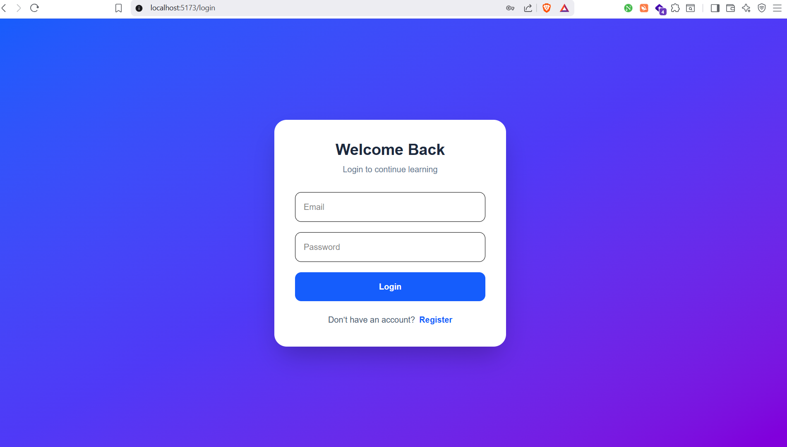
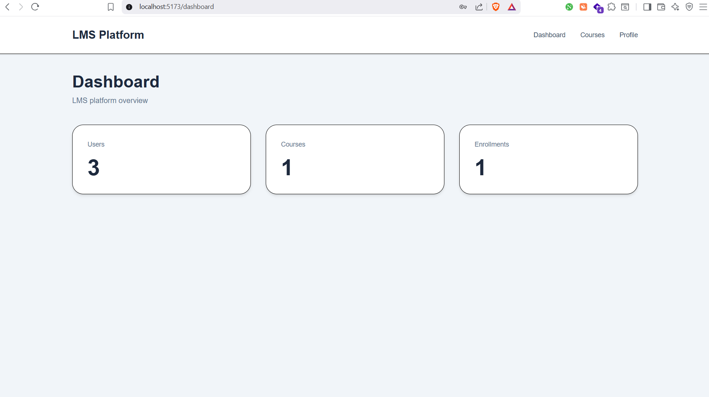
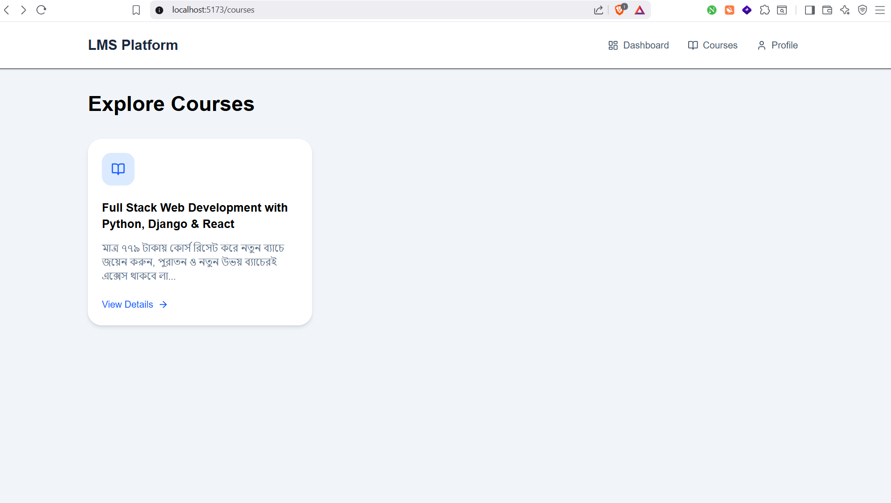

# Learning Management System (LMS)

## Project Overview

The Learning Management System (LMS) is a full-stack web application built to manage online learning activities. It allows users to register, log in securely, browse available courses, enroll in courses, and track learning activity through a dashboard.

This project uses Django REST Framework for backend APIs and React + Tailwind CSS for the frontend UI.

The system supports role-based access:

* **Admin** → manages the platform
* **Instructor** → creates and manages courses
* **Student** → enrolls and learns

---

## Features

### Authentication System

* User registration
* User login
* JWT-based authentication
* Protected routes
* User profile page
* Role-based access control

### Course Management

* Course listing
* Course detail page
* Course enrollment
* Category-based course management

### Dashboard

* Total users statistics
* Total courses statistics
* Total enrollments statistics

### Profile Management

* View user profile
* Role information

---

## Tech Stack

### Backend

* Python
* Django
* Django REST Framework
* Simple JWT
* PostgreSQL / SQLite

### Frontend

* React.js
* Tailwind CSS
* Axios
* React Router DOM
* Lucide React Icons

### Version Control

* Git
* GitHub

---

## Setup Instructions

## Backend Setup

### Clone repository

```bash
git clone <your-repository-url>
```

### Navigate to backend

```bash
cd backend
```

### Create virtual environment

```bash
python -m venv env
```

### Activate environment

Windows:

```bash
env\Scripts\activate
```

### Install dependencies

```bash
pip install -r requirements.txt
```

### Apply migrations

```bash
python manage.py makemigrations
python manage.py migrate
```

### Create admin user

```bash
python manage.py createsuperuser
```

### Run backend server

```bash
python manage.py runserver
```

Backend URL:

```text
http://127.0.0.1:8000/
```

---

## Frontend Setup

### Navigate to frontend

```bash
cd frontend
```

### Install dependencies

```bash
npm install
```

### Run frontend server

```bash
npm run dev
```

Frontend URL:

```text
http://localhost:5173/
```

---

## API Endpoints

### Authentication

* POST /api/auth/register/
* POST /api/auth/login/
* GET /api/auth/profile/

### Courses

* GET /api/courses/
* GET /api/courses/{id}/
* POST /api/courses/create/

### Enrollment

* POST /api/enrollments/
* GET /api/enrollments/my/

### Dashboard

* GET /api/dashboard/summary/

---

## Screenshots

Place screenshots inside:

```text
screenshots/
```

### Login Page



### Dashboard Page



### Course Page



---

## Future Improvements

* Course progress tracking
* Video lessons
* Quiz module
* Certificates

---

## Author

Robiul Haque
